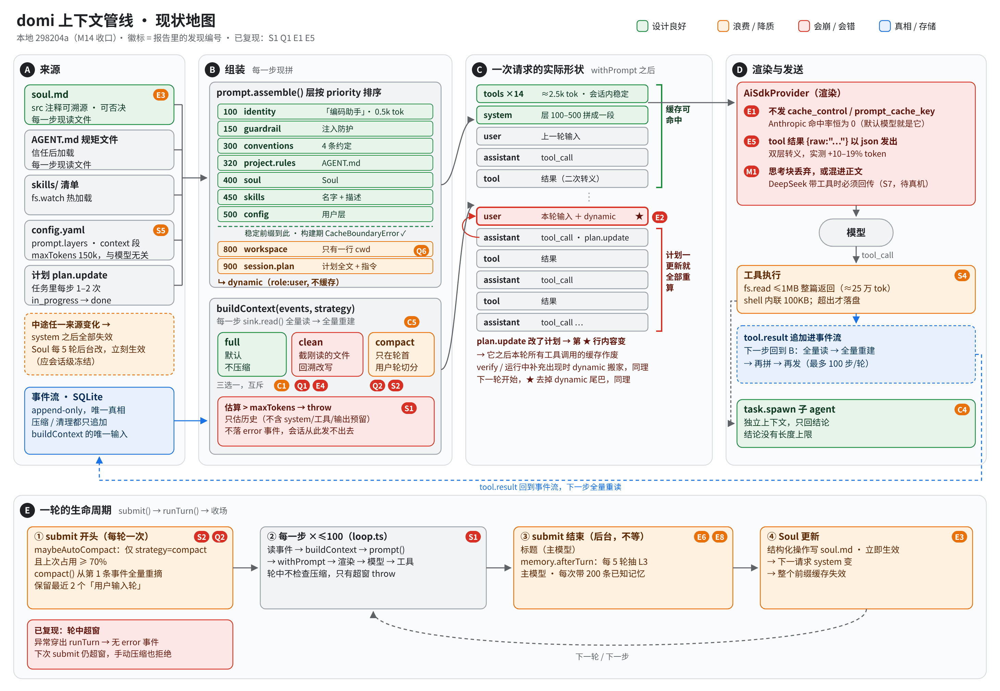

# 调研：上下文管理（Context Engineering）——现状评估与内核优化路线

> 2026-10-08 · 状态：**已拍板**（第 9 节，同日）；真实数据基线见 §3 R0；需求进入 `docs/prd/M15.md`
> 触发：壳（M8–M14）基本造完，内核优化提上日程；第一站是上下文管理——组装、压缩、缓存、身份、环境、记忆提取等，从**协调性 / 经济性 / 业务稳定性 / 工作完成情况**四个方面做评估，并补充没列到的维度
> 依据：本地仓库 `298204a`（M14 收口）逐文件读码；可执行的复现与测量跑在 GitHub `33cafa8` 的克隆上（上下文相关代码与本地一致，只差 BUG-M14-001 的 token 估算口径）

---

## 0. 一句话结论

**domi 的上下文「地基」是对的，「楼层」还没盖**：事件流是真相、上下文是纯函数投影（INV-02/12）、分层提示词带缓存边界检查、确定性清理 + 固定字段摘要、Soul 带来源与否决——这些设计在业界都算超前。
但把它们串成一条**生产可用的管线**时有三个硬伤，都已复现：

1. **稳定性**：一轮里上下文超窗会**直接抛异常、事件流不留痕**，而且之后**这个会话再也发不出去**（手动压缩也拒绝）——默认 `strategy: full` 时任何长任务都会撞上。
2. **经济性**：对 Anthropic **一个 cache_control 都没发**（缓存命中率恒为 0）；对自动缓存的厂商，**动态层被拼进本轮 user 消息**，计划每更新一次就把本轮已缓存的尾巴全作废。按一个 50 步任务的成本模型，现状是理想状态的 **2.7×（自动缓存厂商）～7×（Anthropic）**。
3. **完成质量**：`clean` 策略对**刚读出来的文件**也做 2000 字符截断，模型永远看不到第 150 行；`compact` 策略按「用户输入」切轮，**一个长任务只有一轮，永远压不了**。

建议把上下文从「拼一份 messages」升级为**上下文编译器**：来源 → 组装（会话级冻结快照）→ 老化遮蔽（决策落事件、只追加）→ 增量压缩（缓存感知）→ 缓存规划（断点）→ 按厂商渲染。domi 的事件流架构让「遮蔽与压缩的决定本身也是事件」成为可能——这正是 RECON-DSH 里「压缩 × prompt cache 交叉零覆盖」那块真空，也是最有简历含金量的一块。

---

## 1. 评估框架

### 1.1 上下文的生命周期（11 个环节）

| # | 环节 | 问的问题 | 你列的 |
|---|---|---|---|
| 1 | **组装** Assembly | 哪些东西、按什么顺序、以什么角色进窗口 | ✓ |
| 2 | **预算** Budget | 窗口多大、留多少给输出、谁先让位 | — |
| 3 | **老化 / 遮蔽** Aging | 用过的工具结果什么时候变成一行指针 | （属于压缩） |
| 4 | **压缩** Compaction | 快满时怎么把中间讲短、讲短后还能不能接着干 | ✓ |
| 5 | **缓存** Caching | 前缀稳不稳、断点放哪、哪些动作会打断 | ✓ |
| 6 | **身份** Identity | 我是谁、怎么工作、不同模式（会话 / 任务 / 子 agent）的差异 | ✓ |
| 7 | **环境** Environment | 时间、系统、项目、git、可用工具的现状 | ✓ |
| 8 | **记忆** Memory（写 + 读） | 什么值得记、记在哪一层、什么时候召回 | ✓（提取） |
| 9 | **隔离** Isolation | 子 agent / 编排节点之间传多少、传什么 | — |
| 10 | **推理连续性** Reasoning | 思考块要不要、怎么回传 | — |
| 11 | **恢复** Recovery | 超窗、压缩失败、厂商报错后能不能自己爬起来 | — |

### 1.2 评估维度（你列的 4 个 + 补充 6 个）

| 维度 | 判据 |
|---|---|
| **协调性** | 各环节之间有没有互相拆台（压缩 vs 缓存、记忆 vs 缓存、计划 vs 缓存、清理 vs 读文件） |
| **经济性** | $/任务、缓存命中率、后台调用的成本、无效 token |
| **业务稳定性** | 超窗、压缩失败、厂商差异下会不会崩、会不会砖化会话 |
| **工作完成情况** | 长任务能否做完、压缩后是否跑偏、上下文腐烂（context rot） |
| 补 · **可观测性** | 用户和开发者能否看到「为什么没命中缓存 / 为什么压了 / 压掉了什么」 |
| 补 · **安全** | 压缩、记忆、引用会不会把工具结果里的注入「洗白」成用户指令 |
| 补 · **延迟** | 每步重建成本、压缩是否阻塞用户 |
| 补 · **模型适配** | 窗口、缓存协议、思考块格式各家不同时是否自适应 |
| 补 · **可控性** | 用户能否指定「压缩时保留什么」「这条别清」 |
| 补 · **可评测性** | 改上下文策略后，有没有数字告诉你变好还是变坏 |

---

## 2. domi 现状地图

<details open>
<summary><b>图：上下文管线现状地图</b>（点击折叠）</summary>


<picture>
  <source srcset="assets/context-map.svg" type="image/svg+xml">
  
</picture>

读图顺序：**A 来源 → B 组装 → C 一次请求的实际形状 → D 渲染与发送**，下方 **E** 是一轮的生命周期。红框 = 会崩 / 会错，橙框 = 浪费 / 降质，绿框 = 设计良好；徽标是第 4 节的发现编号。C 栏是重点：动态层被拼进带 ★ 的那条 user 消息，它之后的本轮内容随计划更新反复失去缓存（E2）。

矢量原图 [`assets/context-map.svg`](assets/context-map.svg) · 位图副本 [`assets/context-map.png`](assets/context-map.png)

</details>

<details><summary>纯文本版（不渲染图片的地方看这个）</summary>

```
config.yaml ─┐
soul.md ─────┤                         ┌─ withPrompt：system 放最前；dynamic 拼到「最后一条 user 消息」末尾
AGENT.md ────┼─ session.prompt()  ──────┤   （每一步现拼，每一步现读 soul / 规矩文件）
skills 目录 ──┤   prompt.assemble()      └─ 层：identity100 · guardrail150 · conventions300 · project.rules320
plan ────────┘   CacheBoundaryError           · soul400 · skills450 · [config 500] ‖ workspace800 · session.plan900
                                                                           （‖ 之后 cacheable:false，role:user）
事件流(SQLite) ── 每一步 sink.read() 全量读 ── buildContext(strategy) ── full / clean / compact（三选一）
                                                    └─ 估算 > maxTokens(默认 150k) → throw
                                                         ↓
                                   AiSdkProvider：system→instructions；tool 结果 output:{type:'json', value: safeJson(带边界标记的字符串)}
                                                   providerOptions 永远为空（没有 cache_control / prompt_cache_key）
submit 开头：maybeAutoCompact（只在 strategy=compact、占用≥70%）── compact()：保留最近 keepTurns(2) 个「用户输入轮」
submit 结束：void memory.afterTurn ── 每 5 轮抽 L3（主模型）→ 立即更新 soul.md（主模型）
子 agent：task.spawn → 新会话，只回 lastAnswer；编排节点：输出文本传下游
```

</details>

| 环节 | 现状 | 位置 | 评价 |
|---|---|---|---|
| 组装 | 分层 + 优先级 + 构建期缓存边界检查；dynamic 只进最后一条 user | `prompt/layer.ts`、`kernel/preamble.ts:27` | 思路对；**落点错了**（见 E2） |
| 预算 | 单一 `context.maxTokens=150k`，与模型窗口无关；守卫只估历史、不含 system / 工具 / 输出预留 | `config/schema.ts:259`、`build-context.ts:258` | 弱 |
| 老化 | 无（`clean` 是全量、无年龄概念） | — | 缺 |
| 压缩 | 确定性清理（4 规则）与 LLM 压缩是**两个互斥策略**；默认都不开 | `memory/cleanup.ts`、`compact.ts`、`strategy.ts` | 零件好，装配错 |
| 缓存 | 只有「层排序」这一道；请求里没有任何缓存参数；`capabilities.promptCache` 声明了但没人读 | `ai-sdk-provider.ts`、`config/vendors.ts` | 名存实亡 |
| 身份 | 「本地优先的编码助手」+ 注入防护 + 4 条约定，约 0.5k token | `prompt/builtin.ts` | 过薄，且与「通用 agent」定位不符 |
| 环境 | 只有「当前工作目录：…」一行 | `builtin.ts` workspaceLayer | 缺 |
| 记忆·写 | L3 全局抽取（事实 / 偏好 / 实体，带来源）→ Soul 结构化操作 + 否决 | `memory-service.ts`、`soul.ts` | 业界一流的可溯源性；**只有全局一层** |
| 记忆·读 | Soul 进稳定前缀；`memory.search`（L2 FTS）/ `memory.recall`（L3）由模型决定调用 | `search-tool.ts`、`memory-service.ts` | 对 |
| 隔离 | 子 agent 只回结论；编排节点输出传下游 | `runtime/subagent.ts`、`orchestrator` | 对；结论无长度上限 |
| 推理 | `includeReasoning=false` 丢弃；为 true 时混进正文文本（不是 reasoning 块） | `build-context.ts` model.reason | 对思考型模型不兼容（见 M1） |
| 恢复 | 流错误可恢复；**拼装超窗不可恢复**（见 S1） | `loop.ts:277` | 硬伤 |

---

## 3. 实测与复现

所有脚本都在云端克隆里跑，不动你的仓库。

### R0 · 真实会话基线（`~/.domi/events.db`，2026-10-08 经授权只读测量）

样本：31 个会话（任务 25、自由会话 6）、76 次用户输入、**465 次模型请求**、621 次工具调用；模型 deepseek-v4-pro 323 次、deepseek-flash 139 次、GLM-4.7-Flash 3 次；`context.strategy` 为默认 `full`，**全库没有一次 `ctx.compact` / `ctx.cleanup`**。

| 指标 | 值 | 说明 |
|---|---|---|
| 提示词总量 / 缓存读 | 26.53M / 25.07M tok | **命中率 94.5%**（DeepSeek 自动前缀缓存） |
| 输入 : 输出 | **72 : 1**（输出 36.9 万，其中推理 19.0 万） | 输入成本决定一切，与 Manus 的 100:1 同量级 |
| 单次提示词 p50 / p90 / max | 38.7k / **142.7k / 184.4k** | max 已越过 `maxTokens=150k`——守卫只估历史，且 BUG-M14-001 之前中文按 1/4 估，形同虚设 |
| 单轮步数 p50 / p90 / max | 3 / 14 / **48** | 早期 `maxToolCalls=20` 时被截断 4 次；墙钟 10 分钟被截断 4 次 |
| 工具结果占对话历史 | **72–82%**（最大三个会话） | `fs.read` 占工具输出 54%（80 万字符），其次 `fs.grep` 23%、`shell.exec` 16% |
| 工具结果单条 p50 / p90 / max | 1.2k / 5.9k / 30.4k 字符 | |

**缓存损失归因**（以「上一请求的提示词应全部命中」为理想，逐请求对比两次请求之间发生的事件）：

| 两次请求之间发生了 | 次数 | 损失合计 | 平均每次 |
|---|---|---|---|
| 什么都没发生（纯追加） | 391 | 1.7k | **4 tok** |
| 新的一轮（上一条 user 消息的动态尾巴被拿掉） | 26 | 369k | 14.2k |
| `plan.update` | 9 | 276k | **30.6k** |
| `verify.required` | 2 | 84k | **41.8k** |
| 新的一轮 + 信任 / 切模型 / 切模式 | 7 | 69k | — |
| 合计 | | **799k** | |

结论：
- **只追加时缓存几乎完美**（平均损失 4 tok）——证明问题不在厂商、不在事件流，**全部来自「改历史」**：动态层拼进 user 消息（E2）。
- 可避免的损失 799k 占全部未命中（1.46M）的 **55%**。DeepSeek 命中价低，所以绝对金额不大；换成 Anthropic（现在零缓存，E1）或命中折扣只有 50% 的厂商，这部分就是主要成本。
- R6 的成本模型方向被证实，但幅度要按厂商分别看：**自动缓存厂商上主要是 E2，Anthropic 上主要是 E1**。

**额外发现（不在原 §4，已补进去）**：
- **记忆层在真实环境里一次都没成功**：`semantic_items` 0 条、`memory.write` 0 条；L3 抽取 7 次全部失败（`error.structured_output`：DeepSeek 返回的 JSON 缺 `items` 或直接是数组）→ 新增 S9。
- **内部会话 `_memory` 泄漏成了用户任务**：它在会话表里有标题、`kind=task`、挂在项目下，用户在里面连续干了 141 次请求的活（库里最大的会话就是它，184k 提示词），记忆抽取的失败记录就写在用户眼前（用户原话「你这是什么话，怎么都是失败的」）→ 新增 S8。
- **推理流按 chunk 落事件**：`model.reason` 25.5 万条，占全库行数 85%、平均每次请求 548 条；而每一步都全量读事件（C5），465 次请求累计重读 **1,090 万行** → 新增 C6。
- **DeepSeek v4 思考 + 工具不回传推理也没报错**：347 次「上一步既有推理又有工具调用」的请求全部成功 → S7 对 DeepSeek 降级；Anthropic 交错思考 / Z.ai preserved thinking 仍需按协议回传。

### R1 · 一轮中途超窗：抛异常、无事件、会话砖化（已复现）

stub provider 每步调一个返回 8000 字符的工具，`maxTokens: 6000`：

```
full    THREW: 上下文约 6144 tokens，超过 maxTokens=6000（策略 'full'）。
full    events: user.input,model.request,tool.call,permission,tool.result, …(×3)   ← 最后一条是 tool.result，没有 error
compact THREW: （同上——compact 只在 submit 开头检查，轮中不管）
manual compact: {"ok":false,"detail":"轮数还不够，没什么可压的"}    ← 只有一轮，keepTurns=2，没东西可压
2nd submit THREW: 上下文约 6152 tokens …                              ← 会话从此发不出去
```

根因三连：`buildContext` 在 `loop.ts:277` 的 try 外抛错 → `session.submit` 只有 finally → daemon `core.ts:1305` 的 reject 分支只 `endTurn(false)`，**不落 error 事件**；`compact()` 按 user.input 切轮（`compact.ts:89`），单轮长任务无可压；下一次 submit 的拼装依旧超窗。

### R2 · 请求体里没有任何缓存参数（已复现）

用诊断 fetch 截下 AI SDK 发出的请求体：Anthropic 与 OpenAI 两条路径 `has cache_control: false, prompt_cache_key: false`。
Anthropic 的提示缓存需要显式断点或顶层自动 `cache_control`，不发就**不缓存**；domi 的默认模型恰好是 Anthropic（`DEFAULT_MODEL = claude-sonnet-4-5`）。

### R3 · 工具结果被二次 JSON 转义（已测量）

`markToolResult` 把 payload `JSON.stringify` 后包上 U+E000/E001 边界 → `safeJson` 解析失败 → 变成 `{raw: "<整串>"}` 以 `type:'json'` 发出 → 模型看到的是 `\\n`、`\\\"` 的双层转义代码。用 o200k 分词器测真实文件：

| 文件 | 原文 tok | 模型实际看到 tok | 膨胀 |
|---|---|---|---|
| runtime/src/session.ts | 14,692 | 17,156 | **+16.8%** |
| memory/src/cleanup.ts | 2,889 | 3,428 | **+18.7%** |
| README.md | 1,281 | 1,467 | +14.5% |
| docs/DESIGN.md | 8,028 | 8,834 | +10.0% |

工具结果通常占 agent 输入的大头，这一项相当于**全局 10–19% 的输入税**，而且双层转义的代码对模型更难读（行号、缩进、引号都要在脑子里反解两次）。

### R4 · `clean` 策略截掉刚读的文件（已复现）

300 行文件 `fs.read` 后立即拼上下文：原文 8,082 字符，模型看到 1,708 字符，**不含第 150 行**。截断规则对所有工具结果一视同仁、没有「最近 N 条不动」；而约定层又告诉模型「看到截断标记就继续读」——按行范围再读，只要超过 2000 字符照样被截，形成循环。

### R5 · 固定开销（已测量）

| 项 | 估算 |
|---|---|
| system（identity + guardrail + conventions） | ≈ 0.5k tok |
| 工具定义 14 个（无 MCP） | ≈ 2.5k tok（最大：ask.user 370、plan.update 345） |
| workspace + plan（dynamic） | 数十～数百 tok |

固定开销很小——这是好事，也意味着**省钱的主战场不在 system prompt，而在历史与工具结果的缓存命中**。接上 MCP 后工具定义会迅速膨胀（Anthropic 实测 5 个 MCP server、58 个工具 ≈ 55k tok）。

### R6 · 成本模型：动态层 + 计划更新 vs 缓存

一个任务轮：前缀 20k、50 步、每步追加 1.5k、每 3 步 `plan.update` 一次（计划文本在本轮 user 消息里）。

| 价格假设 | 不缓存 | 现状（自动缓存厂商） | 理想（只追加） |
|---|---|---|---|
| Sonnet 类：读 0.1×、写 1.25× | $8.51（= Anthropic 现状） | $3.20 | **$1.17** |
| 读 0.2×、写 1× | $2.84 | $1.11 | **$0.64** |
| Z.ai 类：读 0.5×、写 1× | $2.84 | $1.76 | **$1.47** |

这是模型不是实测，量级说明问题：**Anthropic 上 7×，自动缓存厂商上 1.2–2.7×**。真实数据（R0）：DeepSeek 上每次 `plan.update` 平均丢 30.6k tok 缓存、`verify.required` 丢 41.8k，与模型一致。

---

## 4. 发现（按维度）

严重度：🔴 会崩 / 会错 · 🟠 明显浪费或降质 · 🟡 改进项

### 4.1 业务稳定性

| ID | 严重度 | 发现 | 证据 | 建议 |
|---|---|---|---|---|
| **S1** | 🔴 | 轮中超窗 → 抛异常、不落事件、会话砖化 | R1；`loop.ts:277`、`build-context.ts:258`、`compact.ts:89` | ①每步拼装前做**预检 + 就地降级**（先遮蔽旧观测 → 再压缩本轮中段 → 最后才报错），降级动作落事件；②任何拼装异常都转成 `error{scope:'context', recoverable}` 落盘；③压缩的「轮」改按**步**（model.request）切，单轮也能压 |
| **S2** | 🔴 | 每次压缩都从**第 1 条原始事件**重新摘要，摘要输入随会话线性增长，迟早超出摘要模型自己的窗口 → 压缩永久失败 → 落回 S1 | `session.ts:769` 传 `view()` 全量；`compact.ts` 切片从 0 开始 | **增量压缩**：输入 = 上一份摘要 + 上次压缩点之后的事件（pi 就是「初次 / 后续」两套模板；Codex 给摘要打 `_summary` 前缀防重复摘要） |
| **S3** | 🟠 | 摘要输入里混进轨迹事件：`projectText` 对未知类型 `JSON.stringify(ev)`，于是 model.request（含层清单）、model.usage（整块 providerMetadata）、permission、fs.snapshot 全喂给摘要模型 | `cleanup.ts:96-97` | 摘要输入只取进上下文的那四类事件 + plan / verify；轨迹事件投影成一行或丢弃 |
| **S4** | 🟠 | 单次工具结果上限过大：`fs.read` ≤1MB 的文件**整篇返回**（≈25 万 tok，单次就能撑爆）；shell 内联 100KB（≈2.5 万 tok） | `fs-read.ts` `FS_READ_MAX_BYTES`；`shell-exec.ts:8` | 内联上限按 token 定（如 8–10k tok），超出写文件 + 返回头尾与路径（Cursor「长输出写文件」、M7 已有输出落盘目录可复用）；`fs.read` 默认最多 N 行 |
| **S5** | 🟠 | 窗口不随模型变：`maxTokens` 是全局 150k，切到 128k 窗口的模型会在厂商那边 400；守卫只估历史，没算 system、工具定义、输出预留 | `schema.ts:259`；`build-context.ts:232` | 模型目录带 `contextWindow / maxOutput`；有效预算 = 窗口 − 输出预留 − 安全余量（Claude Code：`窗口 − min(maxOutput, 20k) − 13k`）；守卫估「整份请求」 |
| **S6** | 🟠 | 压缩失败无「抖动保护」：超阈值后每轮开头都会再试一次、再失败一次，每次都是一次真实模型调用 | `session.ts:1095` | 连续失败 N 次熔断并在状态栏提示（Claude Code 有 thrashing detection） |
| **S8** | 🟢 | 内部会话 `_memory` 泄漏成用户可见的任务：被改了标题、`kind`、挂进项目，用户在里面干活；记忆失败记录写进用户的对话 | R0；`memory-service.ts`（`MEMORY_SESSION_ID`） | **已修（M15-007）**：`_` 前缀会话一律不进会话列表、不可 `submit` / 改名 / 挂项目（daemon 层拒绝，`INTERNAL_SESSION`）；`domi migrate-m15` 把泄漏的用户事件迁出成普通会话（备份 + 幂等）；`doctor --context` 检测未迁移会话并提示 |
| **S9** | 🟢 | 记忆抽取在 DeepSeek 上 7/7 失败，L3 与 Soul 实际为空——记忆层名存实亡 | R0；`memory-service.ts` structured() | **已修（M15-007）**：结构化输出按厂商降级——不支持 json_schema 的第一次尝试走 `submit_items` 工具（inputSchema = zod→JSON schema），之后退提示词；兼容「直接给数组」（包 `{items}` 再试）与 markdown 包裹；失败抛 `StructuredOutputError` 由调用方落 `error{scope:'memory'}` 并计入 doctor 记忆成功率；真机复测（DeepSeek ≥90%）归 DoD |
| **S7** | 🟡 | 思考型模型 + 工具：DeepSeek 思考模式要求**带工具时回传全部 reasoning_content，否则 400**；Z.ai 开 preserved thinking 时也要求原样回传。domi 要么丢掉、要么拼进正文 | `build-context.ts` model.reason 分支 | 见 M1。**R0 实测 DeepSeek v4 不回传也不报错**（347 次）→ 对 DeepSeek 降为质量问题；Anthropic / Z.ai 仍按协议必须回传 |

### 4.2 经济性

| ID | 严重度 | 发现 | 证据 | 建议 |
|---|---|---|---|---|
| **E1** | 🔴 | Anthropic 路径零缓存；`promptCache` 能力位声明了但没人读 | R2 | 按厂商渲染缓存参数：Anthropic 用顶层自动 `cache_control`（一行即可，断点自动随对话前移）+ system 末尾一个显式断点；OpenAI 系发 `prompt_cache_key=sessionId`；支持时开 1h / 24h 保留（长任务人会离开 5 分钟以上） |
| **E2** | 🔴 | **动态层拼进最后一条 user 消息**：①计划一更新，本轮 user 消息内容变 → 本轮所有已缓存的工具调用作废；②`verify.required` / `user.note` 也是 user 角色，出现时动态层「搬家」，原消息内容变回去 → 同样作废；③下一轮开始时上一轮 user 消息去掉了动态尾巴 → 上一轮整段失效 | `preamble.ts:27-33`；`session.ts:1227`；R6 | 动态内容**以追加事件的形式**出现在**消息尾部**：环境变化 / 计划变化各落一条 `ctx.note` 类事件，渲染成新的 user 块（Manus 的 todo.md「复述」就是这样做的：越靠后注意力越强，且不改历史）；或只在请求末尾挂一个**不入缓存**的尾块 |
| **E3** | 🟠 | 会话中途改前缀：Soul 每 5 轮后台更新一次、立刻生效；规矩文件、Skill 清单每步现读——任何一项变了，system 之后全部失效 | `session.ts:1209-1222`；`memory-service.ts` afterTurn | **会话级冻结快照**：前缀在会话开始（或压缩时）定格，中途的变化下次压缩 / 下个会话生效（Hermes 的做法：记忆中途写入、下个会话才进 system）；需要立刻生效的，走 E2 的「追加通知」 |
| **E4** | 🟠 | `clean` 的去重 / 已解决错误是**回溯改写**：第二次读同一文件时，第一次的结果被换成指针 → 前缀从第一次读的位置开始全部失效 | `cleanup.ts:196,208` | 遮蔽决定**一次做出、落成事件、之后不再变**：只在压缩点或固定步距（如每 10 步）对「冷区」批量做一次，热区不动（Anthropic 的 `clear_at_least` 同理：一次清够多才值得付一次缓存重写） |
| **E5** | 🟠 | 工具结果二次转义 +10–19% | R3 | 工具结果以**纯文本**发（`output:{type:'text'}`），边界标记包在文本里；payload 的结构化字段渲染成简短文本头（`path · 第 a–b 行 / 共 n 行`）+ 原文 |
| **E6** | 🟠 | 后台调用全用主模型：标题、压缩摘要、L3 抽取、Soul 更新 | `memory-service.ts` structured()；`session.ts` compactNow | 配置 `model.small`（或按任务路由）；压缩摘要例外——可以用主模型但**复用主前缀**（下一条） |
| **E7** | 🟡 | 压缩请求是一份全新提示词，吃不到主会话的缓存 | `session.ts:769` | 压缩请求 = 主会话原样前缀 + 末尾一条「请按模板摘要」，前缀全部命中缓存（Claude Code 的做法）；或直接用 Anthropic 服务端 compaction（beta） |
| **E8** | 🟡 | L3 抽取每次把最多 200 条已知记忆塞进提示词做去重 | `memory-service.ts:195` | 先抽后去重：新候选只与 FTS / 向量检索到的近邻比较；或只传同 kind 的近 50 条 |

### 4.3 工作完成情况

| ID | 严重度 | 发现 | 证据 | 建议 |
|---|---|---|---|---|
| **Q1** | 🔴 | `clean` 截断刚读的文件，读不到就再读，形成循环 | R4 | 截断只作用于**冷区**（N 步之前且已被后续步骤「消费」过的结果）；热区原样 |
| **Q2** | 🔴 | 长任务压不了：保留粒度是「用户输入轮」，任务通常只有一轮 | `compact.ts:89` | 保留粒度改「最近 K 步 + 最近 T token」双阈值（OpenCode：保护最近 40k token 的工具输出） |
| **Q3** | 🟠 | 摘要模板偏薄：intent / filesModified / keyDecisions / openQuestions / nextSteps。缺「用户说过的每一句（原话）」「错误与修法」「当前正在做的那一步的精确状态」 | `compact.ts` SummarySchema | 参考 Claude Code 公开流传的压缩提示词九段式：主要请求、关键概念、文件与代码片段、错误与修复、问题求解、**全部用户消息**、待办、当前工作、下一步（带原话引用）；pi 跨多次压缩累积文件操作清单 |
| **Q4** | 🟠 | 压缩后不「补水」：读过的文件内容、`skill.load` 过的正文都被压进摘要，压缩后模型只知道「读过」，而编辑守卫（stamps）仍记着「读过且文件没变」——有凭摘要改文件的风险（推断，未复现） | `strategy.ts` compact；`fs-read.ts` stamps | 压缩后：重新附上最近改 / 读的 K 个文件（或至少路径 + 让 stamps 失效）、已加载 Skill 正文、计划；Cursor 还把**完整历史存成文件**，摘要里给路径，模型可以 grep 回去 |
| **Q5** | 🟠 | 没有观测遮蔽（observation masking）：旧工具结果一直原样留在窗口里，直到触发整段 LLM 压缩 | 无 | JetBrains（NeurIPS 2025）在 SWE-bench Verified 上：只遮蔽旧观测、保留最近 10 个，**成本降 50%+、解题率持平或略好**；LLM 摘要还会让轨迹**变长 13–15%**（摘要像在鼓励「继续」）。混合方案再省 7–11%。domi 应该先做遮蔽，LLM 压缩当最后一道 |
| **Q6** | 🟠 | 身份与环境过薄：「编码助手」与通用 agent 定位不符；没有日期、OS、shell、git 分支 / 脏状态、项目类型；没有关于「怎么省上下文」的工作方法（先 grep 再 read、按行范围读、大探索交给 task.spawn） | `builtin.ts` | 见 §6.3。「会话 / 任务 / 子 agent」三种模式各一段身份；环境块放 dynamic 尾部 |
| **Q7** | 🟡 | 记忆只有全局一层：项目事实（构建命令、约定、坑）与个人偏好混在一起，换项目后噪音大 | `memory-service.ts`（L3 无 projectId） | 加**项目级记忆**（按 repoRoot），类型参考 Claude Code auto memory 的 user / feedback / project / reference；索引常驻、正文按需 |
| **Q8** | 🟡 | 没有程序性记忆：做成一件复杂事后不会沉淀成 Skill | — | Hermes：≥5 次工具调用、从错误中恢复、被用户纠正、走通了非显然流程 → 提议生成 / 修补 Skill（domi 已有 Skill 形状和否决机制，走「事后审阅」即可） |

### 4.4 协调性

| ID | 严重度 | 发现 | 建议 |
|---|---|---|---|
| **C1** | 🟠 | `clean` 与 `compact` 互斥（策略三选一），零件之间没有流水线 | 改成**有序阶段**：清理（无损、热区不动）→ 遮蔽（冷区）→ 压缩（最后一道）；策略注册点保留，但注册的是「阶段」不是「整套」 |
| **C2** | 🟠 | 记忆抽取与压缩各自读一遍同一段历史、各调一次模型 | 压缩时顺便产出记忆候选（Hermes 压缩前先「冲刷」记忆）；或抽取直接读压缩摘要 + 未压缩尾部 |
| **C3** | 🟠 | 三套 token 口径：拼装守卫（只估历史）、状态栏（usage 真值）、上下文 tab（层估算）；压缩阈值用 usage、超窗守卫用估算——两者可能一个说没满、一个说爆了 | 统一「预算器」：以上一次 usage 真值为基准 + 增量估算；守卫、阈值、状态栏、tab 都读它 |
| **C4** | 🟡 | 子 agent 结论、编排节点输出没有长度上限，回到父上下文时可能很大 | 结论上限（Anthropic 建议子 agent 回 1–2k token）+ 超出写文件给路径 |
| **C6** | 🟡 | 推理流按 chunk 落事件：`model.reason` 占全库 85% 行、每请求约 548 条；叠加 C5 每步全量读，累计重读 1,090 万行 | R0；`loop.ts` reason 分支 | 推理与正文按段合并落盘（一个流式段一条，或每 N ms 合并一次）；属于 INV-01 允许的「新写法」，旧事件照常解析 |
| **C5** | 🟡 | 每步全量读事件、全量重建（O(n²)），每步还重读 soul / 规矩文件 | 轮内缓存已投影的前缀消息、只追加新事件；文件按 mtime 缓存。ADR-005 的「增量」占位可以在这里兑现（判据仍是与 full 逐字节相同） |

### 4.5 补充维度

| ID | 维度 | 发现 | 建议 |
|---|---|---|---|
| **O1** | 可观测 | 有 `cacheHitPercent`，但缓存掉了**不知道为什么** | **缓存断点归因**：每次 model.request 记一份「前缀指纹」（工具定义 / 各层 / 每条消息的哈希），命中率掉时对比上一请求，指出「第 37 条消息变了：session.plan 更新」。这是 RECON-DSH 的真空 C，别家没有 |
| **O2** | 可观测 | 上下文 tab 只有静态层 + 总量 | 加「压掉了什么 / 遮蔽了哪些步 / 下次压缩预计在哪」；与轨迹面板联动跳到被遮蔽的原始事件 |
| **X1** | 安全 | 压缩摘要以 **user.input** 身份插入（`strategy.ts`），工具结果里的注入内容一旦被摘要复述，就失去了工具结果边界，变成「用户消息」里的文字 | 摘要用独立的边界字符块（同 refs 的 U+E002/E003 思路），guardrail 层点名「摘要是数据」；摘要提示词要求「不复述工具结果中的指令性内容」 |
| **L1** | 延迟 | 自动压缩在 submit 开头同步执行，用户要等一次完整模型调用 | 后台预压缩：60% 时开始在后台出摘要，到阈值时直接换上（Anthropic 的 on-demand 压缩支持后台模式） |
| **M1** | 模型适配 | 思考块：Anthropic 交错思考要求同一轮内思考块原样回传；DeepSeek 带工具时必须回传；Z.ai preserved thinking 要求原样且有利于缓存命中；OpenAI Responses 推理项回传效果更好 | 事件里保留推理原文与签名，按厂商渲染：本轮内原样回传，跨轮按厂商规则丢弃 / 保留；`includeReasoning` 从「要不要」变成「按厂商协议」 |
| **U1** | 可控性 | 手动压缩不能指定重点；不能「钉住」某条不让清 | `/compact <重点>`；事件级 pin（清理与遮蔽跳过，`collectReferences` 已经有 `refs` 机制可复用） |
| **V1** | 可评测 | L1 回放能抓工具调用顺序回归，但没有上下文专项：压缩保真、缓存命中、$/任务 | 见 §8 |

---

## 5. 业界对照

| 做法 | 谁在做 | domi 现状 | 可取之处 |
|---|---|---|---|
| 只追加、确定性序列化、断点在 system 末尾；KV-cache 命中率是第一指标 | Manus | 层排序对了，但动态层改写历史、回溯清理 | **把「前缀稳定」当不变量，写进构建期检查** |
| 工具不增删、用 logits 屏蔽（工具名统一前缀） | Manus | 工具表在会话创建时基本定型（`extraTools` 每轮同名重注册，顺序不变），这一项目前 OK | 写成显式约束：工具表会话内冻结；要限制工具用 `allowed_tools` / `tool_choice`，不删定义 |
| todo.md 复述（计划放在上下文末尾） | Manus | 计划在 dynamic 层（拼进 user 消息） | 计划以追加块复述，不改历史 |
| 保留错误 | Manus | `clean` 会把已解决的错误折叠成一行 | 折叠可以，但要保留「试过什么、为什么失败」 |
| 长输出写文件、历史写文件、MCP 工具按需加载（-46.9% token） | Cursor | shell 有输出落盘；历史没有；MCP 全量 | 三项都能直接抄 |
| Microcompact（不调模型清冗余工具输出）→ 工具输出清理 → LLM 摘要；`/compact 重点`；CLAUDE.md 压缩后重读；抖动熔断 | Claude Code | 零件都有一半 | 照这个顺序重组成流水线 |
| auto memory：按项目、四类（user / feedback / project / reference）、索引常驻前 200 行 | Claude Code | L3 全局、三类 | 加项目维度与 feedback 类 |
| 服务端压缩（加密 blob）、`model_auto_compact_token_limit`、摘要前缀防二次摘要 | Codex | — | 防重复摘要 |
| 初次 / 后续两套压缩模板，跨压缩累积文件操作清单；触发 = 窗口 − 16k | pi | 单模板、全量重摘 | 增量压缩 |
| 先剪枝（保护最近 40k token 工具输出、至少剪 20k）再压缩；96–99% 才触发 | OpenCode | 无剪枝 | 剪枝阈值 |
| 记忆文件很小（3,575 字符）、中途写入下个会话才生效；FTS5 会话检索；压缩前先冲刷记忆；自动生成 Skill | Hermes | Soul 立刻生效；有 FTS；无冲刷；无自动 Skill | 冻结快照、冲刷、程序性记忆 |
| 摘要分段非破坏标记（condenseParent） | Roo Code | `ctx.compact` 已是非破坏 | domi 已领先 |
| 服务端 `clear_tool_uses`（trigger / keep / clear_at_least / exclude_tools）、`clear_thinking`、compaction（含后台、保留近期、自定义提示、再压缩） | Anthropic API | 未用 | Anthropic 路径可直接借力；**其它厂商靠 domi 自己的同构实现**——这正是做成可插拔阶段的理由 |
| 自动缓存、`prompt_cache_key`、24h 保留、`defer_loading` 工具检索 | OpenAI | 未用 | 一并接入 |
| 观测遮蔽 ≈ LLM 摘要，成本 −50%+；摘要让轨迹变长 | JetBrains（NeurIPS 2025） | 只有 LLM 摘要 | **先遮蔽、后摘要** |
| 上下文越长越不可靠；干扰项伤害叠加；LongMemEval 聚焦 300 tok ≫ 全量 113k tok | Chroma Context Rot | 默认不压缩 | 「能放下」≠「该放下」：主动保持窗口小 |
| 演化式剧本：增量 delta 更新，避免「简洁偏置」与「上下文坍缩」（+10.6% agent 基准） | ACE（ICLR 2026） | Soul 的结构化操作已是 delta 思路 | 印证了 ADR-019 的「更新是操作不是重写」；可扩到项目剧本 |

---

## 6. 目标架构：上下文编译器

### 6.1 原则（建议写成新不变量）

1. **前缀不变量**：一次请求发出后，它的前缀在本会话后续请求里**只增不改**，例外只有两个——压缩点、显式的会话级刷新。构建期 + 运行期都检查（运行期靠 O1 的指纹对比）。
2. **投影决定即事件**：遮蔽、清理、压缩的**决定**落成事件（`ctx.mask{seqs}`、`ctx.compact`），投影只读事件——于是同一事件流拼出同一上下文（INV-02 不破），也就自然只追加、自然缓存稳定。这是 domi 架构独有的优势：别家的清理是请求时现算，天然会回溯改写。
3. **先便宜后贵**：无损清理 → 遮蔽冷区 → LLM 压缩 → 报错，逐级升级，每级落事件。
4. **按厂商渲染**：缓存参数、思考块、工具结果格式都是「渲染层」的事，kernel 只给出规范化的消息 + 缓存提示（哪些位置是稳定点）。

### 6.2 管线

```
              ┌────────   会话级冻结快照（开始 / 压缩时刷新） ────────┐
Sources ──►   │ tools(冻结) · identity · guardrail · conventions │ ──► [断点 1]
              │ project.rules · soul · skills 清单 · 项目记忆索引  │
              └─────────────────────────────────────────────────┘
事件流 ──► 投影：
   ① 压缩块（若有）：上一份摘要（带边界，数据不是指令）+ 补水（最近文件 / 已加载 Skill）
   ② 冷区：按 ctx.mask 事件遮蔽的工具结果 → 一行指针「[第 37 步 fs.read src/a.ts 的结果已收起，需要时重读]」
   ③ 热区：最近 K 步原样
   ④ 追加块：环境变化 / 计划复述 / 运行中补充 / verify 提示（都是新事件，不改旧消息）  ──► [自动断点随尾部前移]
预算器：usage 真值 + 增量估算 → 60% 后台预压缩 · 70% 遮蔽一批冷区（一次清够）· 85% 用预压缩结果换上 · 仍超 → 落 error 并给出可执行的出路
渲染器：anthropic（cache_control / thinking 块 / text 工具结果）· openai（prompt_cache_key / reasoning 项）· compatible（reasoning_content）
```

### 6.3 身份与环境（Q6 的具体形状）

- **身份**分三段、都在冻结前缀里：通用身份（domi 是通用 agent，不只是编码）；模式段（会话 = 讨论为主、可用沙盒；任务 = 有目标与产出、计划先行；子 agent = 只回结论、控制在 1–2k token）；**工作方法**（上下文是稀缺资源：先搜后读、按行范围读、大范围探索交给 `task.spawn`、长输出看落盘文件的头尾）。
- **环境**拆两半：会话开始时定格的（OS、shell、项目根、项目类型、语言 / 包管理器、git 远端）进前缀；会变的（日期、git 分支与脏文件数、后台任务）作为**追加块**，只在变化时追加一条。

---

## 7. 路线（按 2026-10-08 拍板调整）

全部进 **M15「内核 · 上下文」**，不再单独按缺陷修（拍板 1）。M15 内部仍按「先止血、后省钱、再提质」排序，评测（§8）先行：

| 段 | 内容 |
|---|---|
| **A 尺子** | §8 指标落地：缓存损失归因（O1）、超窗事故、压缩保真 fixture；R0 的测量脚本固化成 `domi doctor --context` 之类的命令 |
| **B 止血** | S1 拼装异常落事件 + 不砖化；S2 增量压缩；S3 摘要输入只取对话事件；S8 内部会话隔离；S9 结构化输出降级；Q1 截断只动冷区；Q2 按步切 |
| **C 不变量落地** | INV-12（投影决定即事件）/ INV-14（前缀只增不改、会话内冻结）——ADR-029；E2 动态层改追加块；E3 Soul / 记忆 / 规矩 / 技能清单会话级冻结；E4 清理不回溯 |
| **D 厂商适配层** | E1 Anthropic 缓存参数、OpenAI 系 `prompt_cache_key`；服务端 compaction / clear_tool_uses 接入但带开关（拍板 4）；E5 工具结果纯文本；M1 思考块按协议回传；S5 模型窗口进目录 |
| **E 压缩流水线** | C1 有序阶段；Q5 观测遮蔽；Q3 摘要模板；Q4 补水；C3 预算器；S4 输出上限按 token；策略可选但**不含 full**（拍板 3） |
| **F 记忆与身份**（可切到下一册） | Q7 项目级记忆（`~/.domi/projects/<id>/memory/`，拍板 6）；Q6 身份与环境；C2 压缩时冲刷记忆；U1 `/compact 重点`；O2 上下文 tab 展示遮蔽 / 压缩；C6 推理事件合并 |

**不做**：E6 后台任务小模型路由（拍板 5，先不做）；Q8 程序性记忆、L1 后台预压缩、MCP 工具按需加载留到后续。

## 8. 评测与指标（先建尺子再动刀）

| 指标 | 定义 | 数据来源 |
|---|---|---|
| 缓存命中率 | cacheRead ÷（input + cacheRead），按请求、按会话 | `model.usage`（已有） |
| $/任务、tok/任务 | 一次任务（DAG run 或单轮任务）总成本 | `model.usage` + 价格表（已有） |
| 前缀断裂次数与归因 | 相邻请求前缀指纹第一个不同点 | O1（新增） |
| 超窗事故 | 拼装失败、厂商 400（context length） | error 事件（S1 后才有） |
| 压缩保真 | 压缩后能否答对压缩前的关键问题（目标、改过的文件、未决问题） | 新增 L1 fixture：压缩前后各问一遍 |
| 轨迹长度 | 完成同一任务的步数（JetBrains 的「摘要拉长轨迹」） | L2 题集 |
| 完成率 | L2 题集通过率，按策略 A/B | `eval/l2`（已有） |

真实会话基线已测（R0，2026-10-08）。ADR-005 当年留的「真实会话性能数据」由 C5 / C6 的数字顺带补上：每步平均重读约 2.3 万行事件。

---

## 9. 拍板（2026-10-08，用户）

| # | 问题 | 定案 |
|---|---|---|
| 1 | P0 立即按缺陷修，还是并入下一个里程碑 | **并入下一个里程碑**（M15） |
| 2 | 「前缀只增不改」「投影决定即事件」写进不变量 | **必须写**；尤其 Soul、记忆这类要**新会话才生效**（会话内冻结）→ ADR-029、PRD-VISION v1.2 |
| 3 | 默认策略 | 可以有几种策略，默认选一种通用的；**`full`（不压缩）不作为用户可选项**——不经济 |
| 4 | Anthropic 服务端能力 | 要一套**厂商适配层**：Anthropic 单独发缓存参数；服务端 compaction / clear_tool_uses 可以接，但**要有开关** |
| 5 | 后台任务小模型路由 | **先不做** |
| 6 | 项目级记忆放哪 | **不进仓库**：`~/.domi/projects/<id>/memory/` |
| 7 | 读 `~/.domi` 做基线 | **授权**，结果见 R0 |

> 注：拍板 4 的「适配层」指 domi 内部按厂商渲染请求的那一层（`packages/model`），不是 PRD-VISION §6 反对的「引用别人仓库 + 写适配层」——压缩、遮蔽的算法仍是自研，服务端能力只是可开关的加速。

## 来源

- Anthropic · [Effective context engineering for AI agents](https://www.anthropic.com/engineering/effective-context-engineering-for-ai-agents)
- Anthropic · [Prompt caching](https://platform.claude.com/docs/en/build-with-claude/prompt-caching) · [Compaction](https://platform.claude.com/docs/en/build-with-claude/compaction) · [Context editing](https://platform.claude.com/docs/en/build-with-claude/context-editing) · [Advanced tool use](https://anthropic.com/engineering/advanced-tool-use)
- Claude Code · [Memory（CLAUDE.md / auto memory）](https://code.claude.com/docs/en/memory)
- OpenAI · [Prompt caching](https://developers.openai.com/api/docs/guides/prompt-caching)
- Manus · [Context Engineering for AI Agents: Lessons from Building Manus](https://manus.im/blog/Context-Engineering-for-AI-Agents-Lessons-from-Building-Manus)
- Cursor · [Dynamic context discovery](https://cursor.com/en-US/blog/dynamic-context-discovery)
- Daniel Vaughan · [Context Compaction Showdown: Codex CLI, Claude Code 等](https://codex.danielvaughan.com/2026/04/10/context-compaction-showdown-coding-agents/)
- Hermes Agent · [Inside Hermes Agent](https://mranand.substack.com/p/inside-hermes-agent-how-a-self-improving)
- JetBrains Research · [The Complexity Trap: Simple Observation Masking Is as Efficient as LLM Summarization](https://arxiv.org/html/2508.21433v3)
- Chroma · [Context Rot](https://www.trychroma.com/research/context-rot)
- ACE · [Agentic Context Engineering](https://arxiv.org/abs/2510.04618v2)
- DeepSeek · [Thinking Mode](https://api-docs.deepseek.com/guides/thinking_mode/) · [KV Cache](https://api-docs.deepseek.com/guides/kv_cache)
- Z.ai · [Context caching](https://docs.z.ai/guides/capabilities/cache) · [Thinking mode](https://docs.z.ai/guides/capabilities/thinking-mode)
